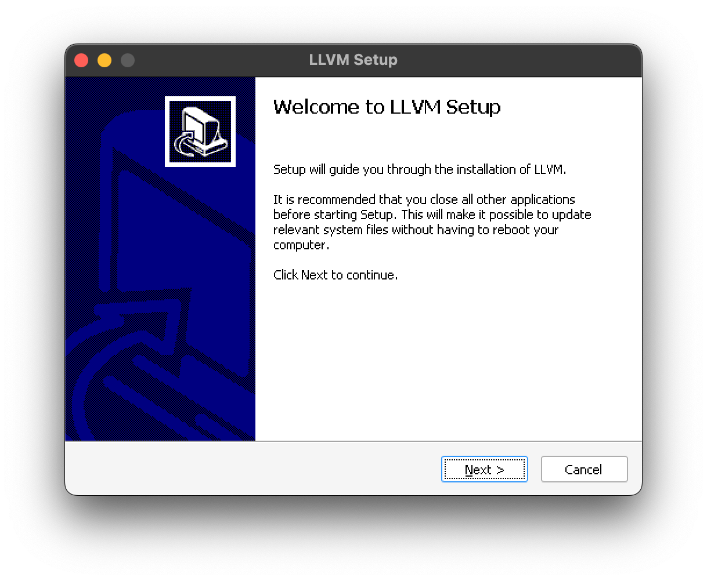
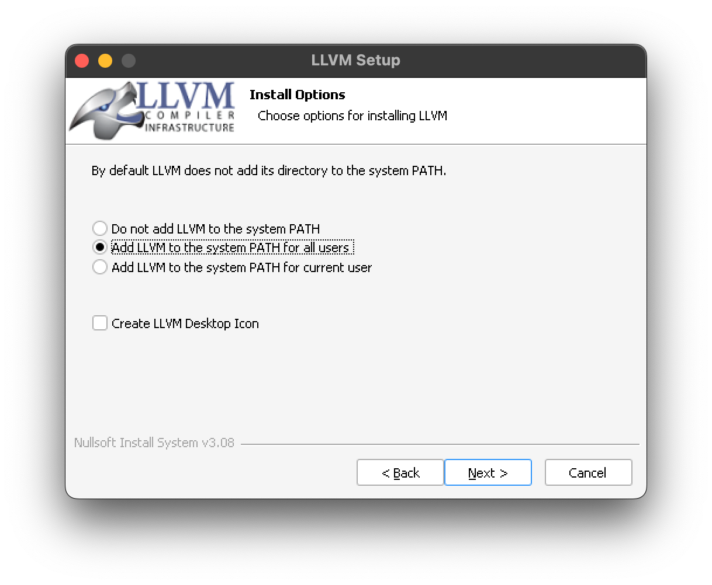
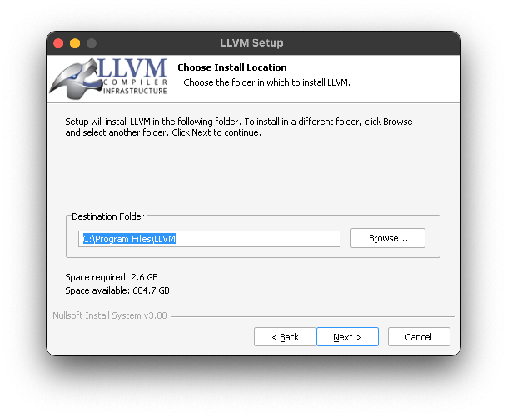
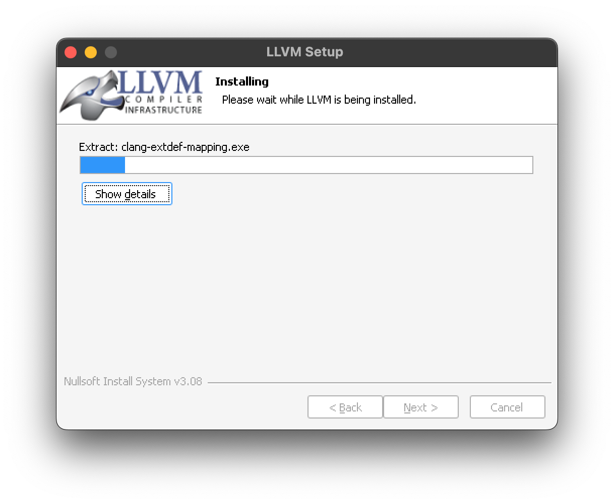

# LLVM/CLANG

미리 사용하고 있던 컴파일러가 있으면 넘어가도 됩니다. \
[Windows](#installation-windows) \
[MacOS](#installation-macos)

설치를 완료했다면 다음 명령어를 터미널에 입력해봅시다.

Windows
```console
clang.exe --version
clang version 17.0.1
Target: x86_64-pc-windows-msvc
Thread model: posix
InstalledDir: C:\Program Files\LLVM\bin
```

MacOS
```bash
$ clang --version
clang version 16.0.6
Target: arm64-apple-darwin23.4.0
Thread model: posix
InstalledDir: /opt/local/libexec/llvm-16/bin
```

## Installation Windows

먼저 [LLVM Release] 에 접속합니다.
다음 EXE파일을 다운받고 실행합니다. \



환경변수에 LLVM Path를 추가하도록 합시다. \




### Installation MacOS

[XCode] 설치하기 또는 XCode Commandline 설치하기
```bash
$ xcode-select --install
```

[Homebrew] 설치하기 
```bash
$ /bin/bash -c "$(curl -fsSL https://raw.githubusercontent.com/Homebrew/install/HEAD/install.sh)"
```

[LLVM Release]: https://github.com/llvm/llvm-project/releases/tag/llvmorg-17.0.1
[XCode]: https://developer.apple.com/kr/xcode
[Homebrew]: https://brew.sh
