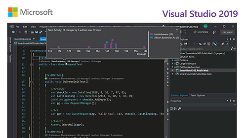
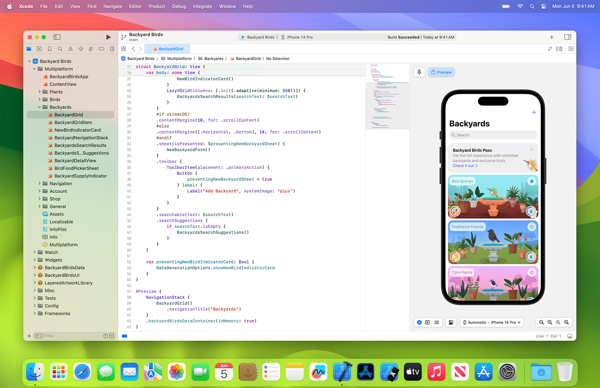

# IDE
- IDE란?

IDE는 통합개발환경(Integrated Development Environment)의 약자로, 소프트웨어 개발을 위한 툴이며, 코드 편집기, 컴파일러, 디버거 등의 도구를 포함하고 있는 통합 환경을 말한다.

## 개발환경

자신이 사용하는 에디터로 진행하여도 괜찮지만, 컴파일링, 링킹, 디버깅 등의 일련의 과정들을 잘 이해하도록 빌드시에는 [터미널](#terminal) 환경에서 진행합니다.

### Visual Studio



### Visual Studio Code


### XCode



## Terminal

다음과 같이 컴파일러를 직접 실행하여 실행파일을 생성하고 실행하여 진행합니다.
```bash
$ cd ./build
$ cat ../src/main.c
#include <stdio.h>

int main(void) {
  printf("Is this code standard?: %s", __STDC__ ? "YES" : "NO");
  return 0;
}
$ clang ../src/main.c
$ ./a.out
Is this code standard?: YES
```

위의 과정이 매우 번거롭기 때문에 컴파일링, 링킹을 이해한 이후에는 간단한 [Makefile](#makefile)로 빌드를 진행합니다.

### Makefile
- MakeFile이란?

Makefile은 소프트웨어 개발 프로젝트에서 사용되는 파일로, 프로젝트의 소스 코드를 컴파일하고 빌드하는 데 필요한 명령어를 정의하는 텍스트 파일이다. Makefile은 프로젝트의 의존성과 빌드 과정을 정의하여 개발자가 손쉽게 프로젝트를 빌드하고 관리할 수 있도록 도와준다. 주로 C, C++, Java 등의 프로그래밍 언어로 작성된 프로젝트에서 사용된다.

다음과 같이 `make` 명령만으로 기존에 손으로 하던 작업들을 자동화 해줍니다.
```bash
$ cat Makefile
```
```bash
CC=clang
CFLAGS=-g3 -Wall
SRC_FILES=$(wildcard src/*.c)
OBJ_FILES=$(SRC_FILES:%.c=%.o)
DBG=lldb

all: asc

%.o: %.c %.h

./asc: ${OBJ_FILES}
	${CC} ${CFLAGS} $^ -framework IOKit -o $@

.PHONY: clean

clean:
	rm -rf asc src/*.o
```
```bash
$ make
```
```bash
clang -g3 -Wall   -c -o src/asc.o src/asc.c
src/asc.c:150:12: warning: unused variable 'key' [-Wunused-variable]
  uint32_t key;
           ^
src/asc.c:165:14: warning: unused variable 'key' [-Wunused-variable]
    uint32_t key;
             ^
src/asc.c:186:10: warning: variable 'ret' is uninitialized when used here [-Wuninitialized]
  return ret;
         ^~~
src/asc.c:183:20: note: initialize the variable 'ret' to silence this warning
  kern_return_t ret;
                   ^
                    = 0
3 warnings generated.
clang -g3 -Wall   -c -o src/main.o src/main.c
clang -g3 -Wall   -c -o src/print.o src/print.c
clang -g3 -Wall src/asc.o src/main.o src/print.o -framework IOKit -o asc
```

